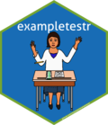

# `exampletestr` 

An R package to help developers create unit tests (designed for use with
the `testthat` package) for their package, based on the examples in
their package documentation.

[](https://github.com/rorynolan/exampletestr/actions)
[](https://ci.appveyor.com/project/rorynolan/exampletestr)
[](https://codecov.io/github/rorynolan/exampletestr?branch=master)


[](https://lifecycle.r-lib.org/articles/stages.html)

[](https://cran.r-project.org/package=exampletestr)


## Installation

To install the release version from
[CRAN](https://cran.r-project.org/package=exampletestr):

``` r
install.packages("exampletestr")
```

To install the dev version from
[GitHub](https://github.com/rorynolan/exampletestr):

``` r
remotes::install_github("rorynolan/exampletestr")
```

## Use

To learn how to use `exampletestr`, visit the package’s website at
<https://rorynolan.github.io/exampletestr/>.

## Contributing

The preferred method of contribution is via GitHub pull request. Please
note that the `exampletestr` project is released with a [Contributor
Code of Conduct](inst/CODE_OF_CONDUCT.md). By contributing to this
project, you agree to abide by its terms. \# Contribution Contributions
to this package are welcome. The preferred method of contribution is
through a github pull request. Feel free to contact me by creating an
issue. Please note that this project is released with a [Contributor
Code of Conduct](CONDUCT.md). By participating in this project you agree
to abide by its terms.
